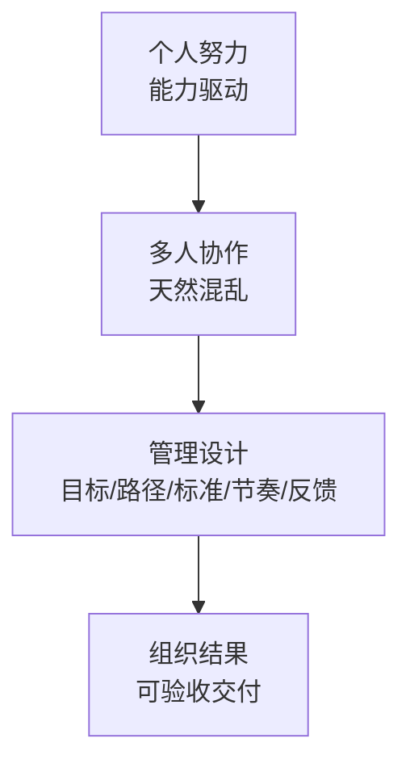

# 第1天：看清管理的本质

## 今天要抓住的一句话

管理不是管人，管理是让一群人围绕同一个目标，持续、稳定、低内耗地产出结果。

## 图：从“个人努力”到“组织结果”

## 常见概念（通俗版）

1. 管理者：不是“更高级的员工”，而是“团队结果负责人”。
2. 结果：能验收、能判断成败的交付（而不是“努力/忙/开会”）。
3. 组织结果：把很多人的动作，变成同一个方向的合力。

## 表：管理者最小关注面（5 件事）

| 关注点 | 你要产出什么 | 最常见坑 |
|---|---|---|
| 目标 | 可验收的结果 | 口号化、不可衡量 |
| 路径 | 谁做什么到什么程度何时交付 | 只说“推进一下” |
| 标准 | 完成定义/验收清单 | “差不多了” |
| 节奏 | 每天/每周/节点的对齐与验收 | 最后一天才发现爆雷 |
| 反馈 | 及时具体指向行为的校准 | 情绪输出、攻击人格 |

## 常见问题（以及你该怎么想）

1. “大家都很忙，为什么结果不好？”
忙不等于有效；没有设计，团队默认会走向混乱（理解不一、优先级不一、标准不一、没人对最终结果负责）。

2. “管理是不是就是盯人、催进度？”
差的管理在盯人，好的管理在设计：目标、路径、标准、节奏、反馈。

3. “我到底从哪开始学管理？”
从认知升级开始：你要对团队最终结果负责，而不是只对自己的那摊事负责。

## 最佳实践（今天就能用）

1. 写下你对团队“最终结果”的一句话定义：必须可验收（能判断成败）。
2. 把你最近一次“结果不理想”的经历复盘成一句话：问题是“人不行”，还是“目标/路径/标准/节奏/反馈”没设计好。
3. 以后布置事时，少说“推进一下/尽快搞定”，多问自己：我有没有把结果讲清楚。

## 今日练习（10 分钟）

用 3 句话回答：

1. 我的团队本月要交付的“可验收结果”是什么？
2. 现在最可能导致拿不到结果的 1 个混乱点是什么？
3. 我明天准备先把哪个“设计”补上（目标/路径/标准/节奏/反馈）？

## 优先级（今天先做什么）

| 优先级 | 事项 | 完成标准 |
|---|---|---|
| P0 | 写出团队“可验收结果”的一句话 | 看到就能判断成败 |
| P1 | 选 1 个最近失败案例，定位缺哪一环 | 能明确缺的是目标/路径/标准/节奏/反馈之一 |
| P2 | 把高频口头指令改写成“结果表述” | 至少改写 3 句（如“推进一下”） |
