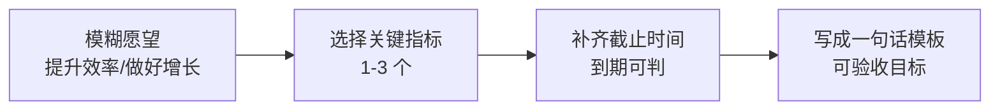

# 第2天：定目标

## 今天要抓住的一句话

目标不是口号，目标是可以被验收的结果。

## 图：把“愿望”改写成“可验收目标”

## 常见概念（通俗版）

1. 模糊目标：比如“提升效率/优化体验/做好增长”，听起来对，但无法验收。
2. 可验收目标：有数字、有截止时间，完成与否一眼可判。
3. 目标三要素：清楚、可衡量、有截止时间。

## 表：目标写法对照

| 类型 | 例子 | 问题/优点 |
|---|---|---|
| 模糊 | “提升效率” | 无法验收、无法拆解 |
| 可验收 | “5 月 30 日前将客服响应从 10 分钟降到 3 分钟” | 到期一眼可判、便于拆任务 |
| 可验收 | “本月新增注册 3000 人，转化率从 2% 到 3%” | 有数字、有期限、有方向 |

## 常见问题（以及你该怎么做）

1. “我不知道该用什么指标？”
先从“最终交付物/最终效果”倒推：用户数、转化率、投诉率、上线时间、响应时长、延期率等。

2. “指标太多怎么办？”
先选 1-3 个最关键的验收指标，别让团队在一堆指标里失焦。

3. “目标定得很硬，团队会反弹吗？”
先把目标说清楚，再把路径和资源说清楚。目标硬不硬不是关键，关键是有没有可执行的拆解和节奏。

## 最佳实践（今天就能用）

1. 用这个模板写目标：
`在 <截止日期> 前，把 <指标> 从 <当前> 提升到 <目标>（或完成 <交付物>）。`

2. 目标落地前做一次“验收自测”：
把目标拿给团队成员看，问一句：“如果到期了，怎么判断算完成？”

3. 目标表述优先选“结果”，少写“动作”：
“新增 3000 注册用户”比“做 10 场活动”更像目标。

## 今日练习（15 分钟）

把你当前一个模糊目标，改写成可验收目标：

1. 原句（模糊）：__________
2. 新句（可验收）：__________
3. 验收方式（一句话）：__________

## 优先级（今天先做什么）

| 优先级 | 事项 | 完成标准 |
|---|---|---|
| P0 | 把当前最重要的 1 个目标改成可验收句子 | 至少含“指标 + 数字/状态 + 截止日期” |
| P1 | 为目标写出“验收方式一句话” | 别人读完知道怎么验收 |
| P2 | 列出 3 个可能阻碍达成的风险点 | 每条风险能对应到后续拆解/资源 |
