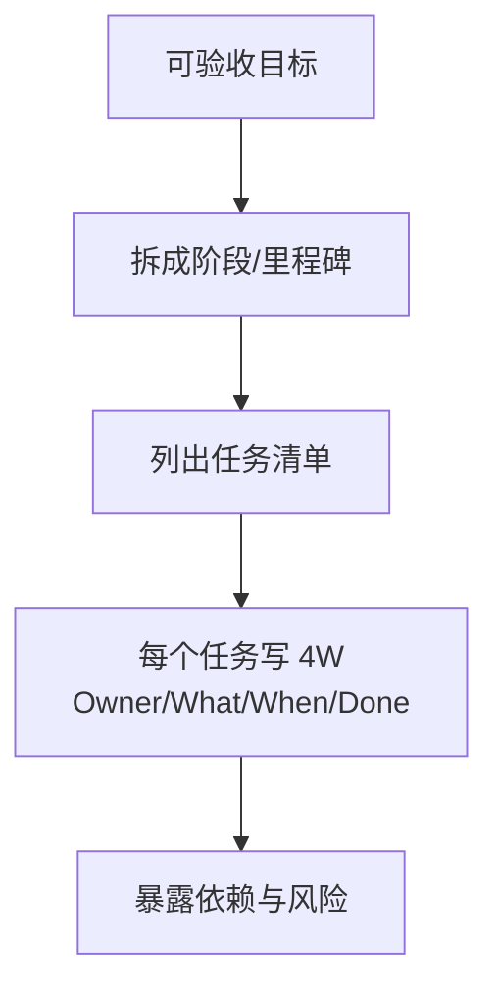

# 第3天：拆任务

## 今天要抓住的一句话

团队不是被目标压垮的，而是被“目标太大、任务太虚”压垮的。

## 图：目标到任务卡（4W）的落地链路

## 常见概念（通俗版）

1. 任务拆解：把“要赢什么”拆成“谁在什么时候交付什么”。
2. 负责人：对结果负责的人，不是“参与者”。
3. 交付物：能被看到/被检查的产出（文档、页面、接口、报告、数据结果）。
4. 验收标准：什么算“做完”（避免“差不多了”）。

## 表：任务卡（4W）模板

| 字段 | 写法 | 示例 |
|---|---|---|
| Owner | 唯一负责人 | 张三 |
| What | 可检查交付物 | “完成登录页前端 + 状态页” |
| When | 明确截止时间 | 5/30 18:00 |
| Done | 验收标准/完成定义 | “联调通过 + 异常态齐全 + 测试验证通过” |

## 常见问题（以及你该怎么做）

1. “大家都参与，但总感觉没人负责。”
这是典型风险信号。任何任务必须有一个唯一负责人。

2. “我说了‘你推进一下’，为什么对方还是做不出来？”
因为缺 4 个信息：谁负责、先做什么、做到什么程度、什么时候交付。

3. “拆到什么颗粒度才够？”
拆到可以在 1-3 天内验收一次，且能明确风险点为止。

## 最佳实践（今天就能用）

1. 用 4W 写任务卡：
`Owner（谁负责）/ What（交付物）/ When（截止）/ Done（验收标准）`

2. 一句话避免“烂账”：
凡是没有负责人的任务，最后都会变成烂账。

3. 任务拆解时优先暴露依赖：
接口依赖、资源依赖、跨部门依赖、审批依赖，写出来才好协调。

## 今日练习（20 分钟）

选一个你正在推进的目标，拆出 5-10 个任务卡（每个任务都要写 4W）。

## 优先级（今天先做什么）

| 优先级 | 事项 | 完成标准 |
|---|---|---|
| P0 | 所有任务都指定“唯一负责人” | 每条任务只有 1 个 Owner |
| P1 | 每条任务都有“交付物 + 截止 + 验收” | 不出现“推进一下/尽快搞定” |
| P2 | 标记依赖与风险 | 至少标出 3 个关键依赖/卡点 |
