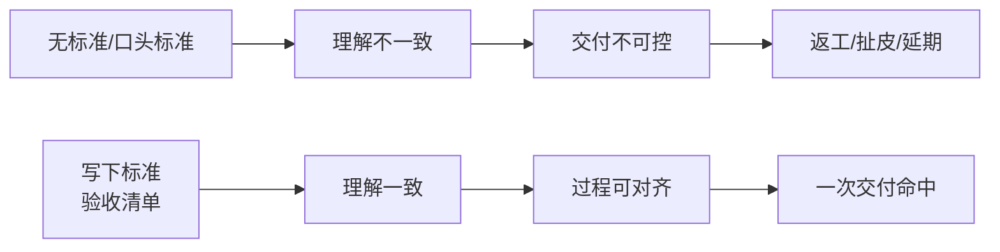

# 第4天：建标准

## 今天要抓住的一句话

最可怕的一句话是“差不多了”；没有标准，就没有管理，只有感觉。

## 图：为什么标准会直接决定返工与扯皮

## 常见概念（通俗版）

1. 标准：对“完成”的统一定义。
2. 验收清单：把抽象标准写成可勾选的条目。
3. 返工成本：标准不清导致的反复修改、扯皮、延期。

## 表：最小“完成定义（DoD）”示例（可直接复用）

| 交付物类型 | 最小完成定义（示例） |
|---|---|
| 功能/页面 | 正常态 + 空态 + 错误态齐全；联调通过；测试验证通过；回滚方案就绪；负责人验收通过 |
| 文档 | 目标清晰；范围边界明确；关键决策与取舍写清；结论可执行；责任人与截止时间明确 |
| 汇报 | 结论在前；数据支撑；风险与需要支持写清；下一步动作明确（Owner/When/Done） |

## 常见问题（以及你该怎么做）

1. “我以为做完了，他也以为做完了，怎么还不行？”
因为你们心里的“做完”不是同一个版本。标准必须写下来，而不是靠默契。

2. “标准是不是越多越好？”
不是。先把最容易出事故的关键点标准化（空状态/异常状态/回滚/测试等）。

3. “标准会不会让团队觉得我在苛刻？”
标准的目的不是苛刻，是减少扯皮和返工，让交付更可控。

## 最佳实践（今天就能用）

1. 用“Definition of Done（完成定义）”代替“做完”：
把交付拆成几条硬条件，例如：联调完成、异常处理完成、测试验证完成、回滚方案就绪、负责人确认通过。

2. 标准提前讲，别等最后验收才翻脸：
开工前 5 分钟对齐一次，比收尾时吵 2 小时划算。

3. 先标准化最常见交付物：
文档、需求、代码、上线、汇报、复盘各自都可以有一份最小清单。

## 今日练习（15 分钟）

为你团队最常交付的一类东西写一份 8-12 条的验收清单（可勾选）。

## 优先级（今天先做什么）

| 优先级 | 事项 | 完成标准 |
|---|---|---|
| P0 | 为最高频交付物写 1 份 DoD | 8-12 条可勾选清单 |
| P1 | 把 DoD 放到任务卡里作为验收条件 | 每条关键任务都引用 DoD |
| P2 | 每次开工前 5 分钟对齐标准 | 团队成员能复述“什么算完成” |
