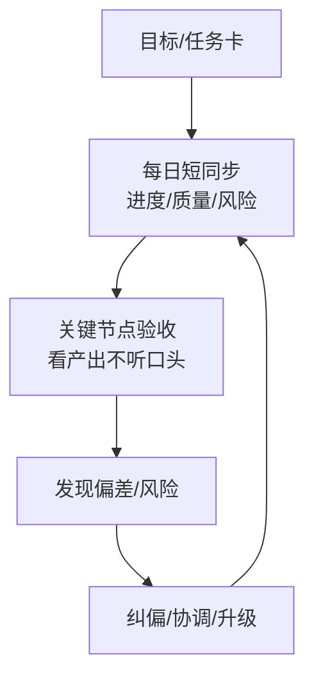

# 第5天：抓过程

## 今天要抓住的一句话

过程不透明，结果一定不可控；好的管理是第一天就知道哪里可能出问题。

## 图：过程管理的“可见化”闭环

## 常见概念（通俗版）

1. 过程管理：让进度、质量、风险可见，而不是靠最后“开奖”。
2. 风险：任何可能导致无法按时/按质交付的因素（依赖、资源、技术难点、需求变更）。
3. 节奏：每天看什么、每周对齐什么、关键节点怎么验收。

## 表：每日 10 分钟检查清单（示例）

| 检查项 | 你要问的关键一句话 | 记录方式 |
|---|---|---|
| 进度 | “离截止还差多少？剩余工作量是什么？” | 任务卡状态/燃尽 |
| 质量 | “当前产出有哪些未覆盖的状态/边界？” | DoD 勾选 |
| 风险 | “最大卡点是什么？需要谁支持？” | 风险清单 |
| 依赖 | “依赖谁？何时能拿到？” | 依赖列表 |
| 升级 | “如果今天拿不到支持，会造成什么影响？” | 升级记录 |

## 常见问题（以及你该怎么做）

1. “我一跟进就被说成在催、在 micromanage。”
你要问“风险”和“卡点”，而不是问“你怎么还没做”。盯风险，团队会更愿意沟通。

2. “我总是最后一天才发现要延期。”
说明你缺节奏和中间验收点。把项目切成更小的可验收阶段。

3. “每天开会太浪费时间。”
你要的是短节奏，不是长会议。每天 10 分钟看进度和风险就够。

## 最佳实践（今天就能用）

1. 每天 10 分钟同步 3 件事：
进度是否正常、质量是否偏离、风险是否暴露。

2. 关键节点必须“验收”，不要只“汇报”：
能看产出就看产出（页面/接口/文档/数据），别只听口头状态。

3. 风险升级要有规则：
当发现“可能延期/质量不可控/跨部门卡住”时，立刻升级，而不是自己硬扛。

## 今日练习（10 分钟）

为你正在推进的一件事，写一个“每天 10 分钟”检查清单（最多 6 条），并设定 2 个关键验收节点。

## 优先级（今天先做什么）

| 优先级 | 事项 | 完成标准 |
|---|---|---|
| P0 | 建立“每天 10 分钟”短节奏 | 固定时间 + 固定 3 问（进度/质量/风险） |
| P1 | 设 2 个关键验收节点 | 节点到来时必须看到可验收产出 |
| P2 | 写出风险升级规则 | 明确“什么情况必须升级 + 升级给谁 + 多久响应” |
