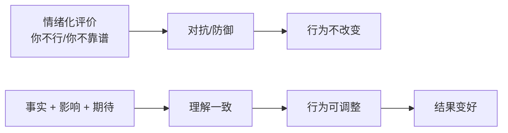

# 第6天：做反馈

## 今天要抓住的一句话

反馈不是情绪输出，反馈是校准行为，让结果变好。

## 图：反馈从“情绪”变成“可改动作”

## 常见概念（通俗版）

1. 反馈：告诉对方“哪里做得对继续、哪里偏了要纠、哪里差了要升级”。
2. 行为 vs 人格：反馈要指向行为，不要攻击人格。
3. 好反馈三要素：及时、具体、能改。

## 表：反馈句式（可直接套用）

| 模块 | 你说什么 | 例子 |
|---|---|---|
| 事实 | “发生了什么” | “昨天约定 18 点前给结果，但你没有同步延期原因。” |
| 影响 | “造成了什么后果” | “导致后面联调被卡，测试时间被压缩。” |
| 期待 | “下次怎么做” | “下次有风险至少提前 2 小时同步，并给出新时间点。” |

## 常见问题（以及你该怎么做）

1. “我一反馈，对方就玻璃心。”
你检查一下表达：是不是把“事”说成了“人”。把评价从“你不行”改成“这次具体哪里没做到、造成了什么后果、下次怎么做”。

2. “我该不该当众反馈？”
当众表扬更有效；纠偏和批评尽量私下，除非问题影响面很大且需要统一规则。

3. “我讲了很多次还是不改。”
可能缺的不是反馈，而是标准、节奏、或升级机制（需要明确后果/资源支持/训练）。

## 最佳实践（今天就能用）

1. 用这个反馈句式：
`事实（发生了什么） + 影响（带来什么后果） + 期待（下次怎么做）`

示例：
“昨天约定 18 点前给结果，但你没有同步延期原因，导致后面联调被卡。下次如果有风险，至少提前 2 小时同步。”

2. 反馈优先讲过程，不只盯结果：
结果不好往往是过程偏了。把关键行为校准，结果才会稳定。

3. 记录重复出现的问题：
同类问题出现 2-3 次，就要从“个人问题”升级为“机制问题”去解决。

## 今日练习（10 分钟）

把你想说的一句“情绪化反馈”，改写成“事实 + 影响 + 期待”的版本：

1. 原句：__________
2. 改写：__________

## 优先级（今天先做什么）

| 优先级 | 事项 | 完成标准 |
|---|---|---|
| P0 | 把 1 条情绪化反馈改写成“事实+影响+期待” | 对方听完知道怎么改 |
| P1 | 建立“及时反馈”的触发点 | 问题发生当天反馈，不积压 |
| P2 | 对重复问题做“机制升级” | 同类问题出现 2-3 次就补标准/节奏/升级规则 |
