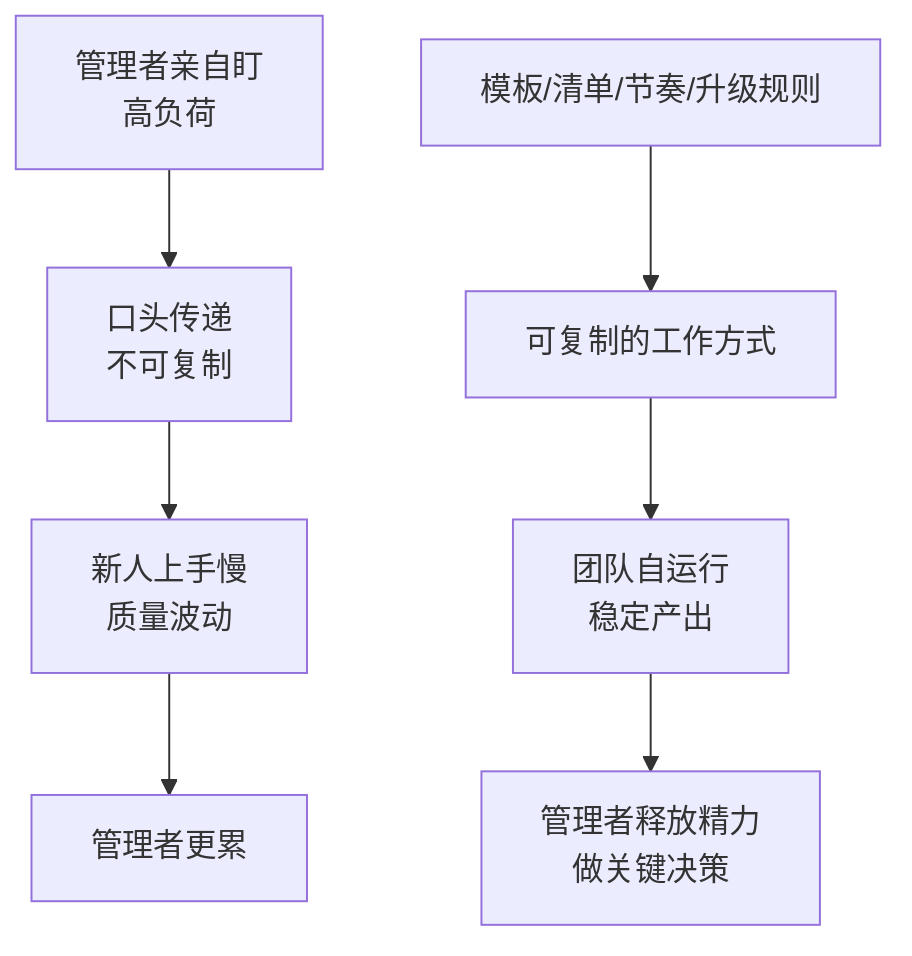

# 第7天：沉淀机制

## 今天要抓住的一句话

普通管理者靠经验，高手靠系统；机制才能复制给团队。

## 图：从“靠人盯”到“靠机制跑”

## 常见概念（通俗版）

1. 机制：让“新人来了知道怎么做、项目来了知道怎么拆、问题来了知道找谁”的固定做法。
2. 模板：把关键思考项固定下来（目标模板、任务卡模板、复盘模板）。
3. 清单：把易漏点变成可勾选的检查项（验收清单、上线清单）。
4. 升级机制：遇到风险谁拍板、怎么升级、多久给响应。

## 表：最小可用机制（建议从这 6 个开始）

| 机制 | 解决什么 | 最小产出 |
|---|---|---|
| 目标模板 | 目标口号化 | 1 页目标写法 + 验收方式 |
| 任务卡模板 | “推进一下”无法执行 | 4W（Owner/What/When/Done） |
| 每日节奏 | 最后一天才爆雷 | 每天 10 分钟：进度/质量/风险 |
| 每周节奏 | 优先级漂移 | 每周对齐一次：目标/资源/风险 |
| 验收清单 | “差不多了”返工 | DoD 勾选清单 |
| 风险升级规则 | 卡点无人拍板 | 触发条件 + 升级对象 + 响应时限 |

## 常见问题（以及你该怎么做）

1. “我不盯就出问题，我一盯就很累。”
说明机制没建立，团队靠你个人在兜。把你每天重复说的东西写成模板/清单/节奏。

2. “机制是不是很重，会不会降低灵活性？”
机制先做“最小可用”，解决最高频、最高风险的问题；不是一次性把一切都流程化。

3. “沉淀什么最划算？”
优先沉淀：目标模板、任务拆解模板、日报/周报模板、验收清单、复盘模板、问题升级规则。

## 最佳实践（今天就能用）

1. 找到你最常重复的 3 类沟通，把它们模板化：
例如“目标怎么写”“任务怎么拆”“延期怎么同步”。

2. 把经验变成可复用的材料：
不靠口头传授，靠文档/表格/清单，让团队自运行。

3. 机制是为了省管理者的命：
当机制能跑起来，你的精力才能回到“关键决策”和“资源协调”上。

## 今日练习（20 分钟）

写一份你团队的“最小机制清单”（先 6 条就够）：

1. 目标模板（1 份）
2. 任务卡模板（1 份）
3. 每日节奏（每天看什么）
4. 每周节奏（每周对齐什么）
5. 验收清单（1 份）
6. 风险升级规则（1 条）

## 优先级（今天先做什么）

| 优先级 | 事项 | 完成标准 |
|---|---|---|
| P0 | 把“目标模板 + 任务卡 + 验收清单”三件套落地 | 团队能直接拿来用（可复制） |
| P1 | 固定每日/每周节奏 | 2 周内不靠人催也能推进 |
| P2 | 建立风险升级规则并试运行 | 任何重大卡点 24 小时内有决策路径 |
