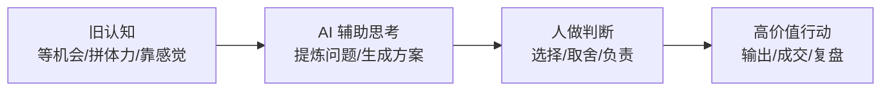

# 第1天：清空旧认知

## 今天要抓住的一句话

AI 不是替你偷懒的工具，而是帮你把低价值劳动压缩掉，把注意力还给判断和行动。

## 图：旧认知到新认知

## 常见概念（通俗版）

1. 旧认知：把努力等同于价值，把忙碌等同于成长，把提问等同于会用 AI。
2. 新认知：先定义结果，再让 AI 补信息、拆路径、提方案，最后由人判断和执行。
3. 认知杠杆：同样一小时，别人只完成一件事，你能完成思考、方案、表达和复盘。

## 表：需要清掉的 5 个旧习惯

| 旧习惯 | 问题 | 新做法 |
|---|---|---|
| 情绪内耗 | 消耗注意力，不能产出结果 | 先写事实，再让 AI 拆选项 |
| 无效社交 | 只混圈子，不交换价值 | 明确自己能提供什么 |
| 躺平等待 | 把机会交给外部环境 | 每天主动产出一个可见结果 |
| 随便提问 | AI 输出泛泛而谈 | 给目标、背景、标准和约束 |
| 只收藏不执行 | 输入很多，结果为零 | 每次学习都转成一个动作 |

## 常见问题（以及你该怎么想）

1. “我不会用 AI，是不是已经落后了？”
真正拉开差距的不是工具熟练度，而是你能不能把问题定义清楚。AI 会放大清晰，也会放大混乱。

2. “AI 会不会替代我？”
AI 会替代大量重复表达、资料整理和初稿产出。你要保住的是判断、审美、信任、资源整合和最终负责。

3. “我每天应该从哪里开始？”
从一个真实问题开始：今天最重要的结果是什么，阻碍是什么，需要 AI 帮你补哪一段。

## 最佳实践（今天就能用）

1. 提问前先写四件事：目标、背景、标准、限制。
2. 所有 AI 输出都必须经过你的判断，不直接照搬。
3. 每天至少把一个想法变成可见产出：文档、话术、方案、复盘或交付物。

## 今日练习（10 分钟）

用 AI 梳理你今天最重要的一件事：

1. 我要拿到的结果是什么？
2. 现在最大的阻碍是什么？
3. 我需要 AI 帮我生成哪些选项？
4. 我准备马上执行哪一步？

## 优先级（今天先做什么）

| 优先级 | 事项 | 完成标准 |
|---|---|---|
| P0 | 写出一个真实目标 | 能判断完成与否 |
| P1 | 用“目标/背景/标准/限制”重写一次提问 | AI 输出明显更具体 |
| P2 | 产出一个可见结果 | 至少完成一份文档、话术、清单或方案 |
