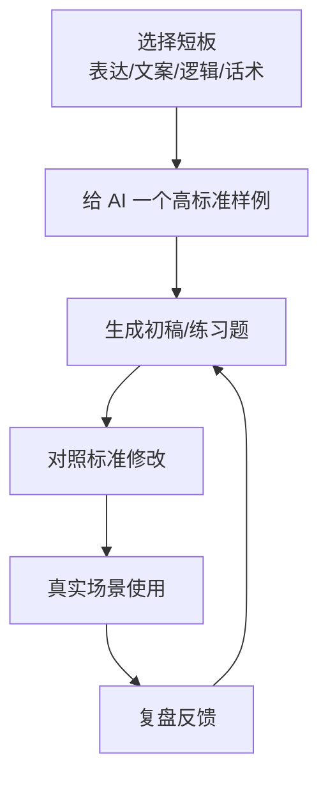

# 第2天：用 AI 补齐短板

## 今天要抓住的一句话

短板不是靠焦虑补齐的，而是靠标准、训练和反馈补齐的；AI 可以让这个过程缩短十倍。

## 图：AI 训练短板闭环

## 常见概念（通俗版）

1. 能力短板：那些经常让你卡住、返工、错失机会的能力。
2. 标准样例：你认可的好表达、好方案、好话术，用来让 AI 学习风格和质量。
3. 训练闭环：生成、修改、使用、反馈，而不是只看 AI 给的答案。

## 表：普通人最该先补的 4 个短板

| 短板 | AI 可以帮什么 | 你必须负责什么 |
|---|---|---|
| 表达 | 改写、压缩、增强说服力 | 判断场景和语气 |
| 文案 | 生成标题、结构、卖点 | 确认真实价值和边界 |
| 商业逻辑 | 拆需求、成本、利润、复购 | 选择真实赛道和客户 |
| 职场话术 | 准备汇报、谈判、拒绝、反馈 | 维护关系和承担结果 |

## 常见问题（以及你该怎么做）

1. “AI 写得很假怎么办？”
先给真实背景和真实语气，再要求它减少套话。你还要补充具体事实，AI 不能替你凭空建立可信度。

2. “我不知道自己短板是什么。”
看最近 30 天让你吃亏的地方：表达不清、方案不成、成交失败、沟通卡住，最高频的就是优先短板。

3. “补短板会不会太慢？”
不要泛泛学习。围绕一个真实场景训练 20 次，比收藏 200 个教程更有效。

## 最佳实践（今天就能用）

1. 给 AI 一个角色：让它作为教练、面试官、客户、老板或用户来反馈你。
2. 给 AI 一个标准：简洁、有力、可执行、像真人说话、适合当前关系。
3. 每次只训练一个短板，连续 7 天，不频繁换方向。

## 今日练习（15 分钟）

选择一个短板，用 AI 完成 3 轮训练：

1. 原始版本：你自己先写一版。
2. AI 修改：让 AI 按标准优化。
3. 你再判断：保留真实信息，删掉空话，形成最终版。

## 优先级（今天先做什么）

| 优先级 | 事项 | 完成标准 |
|---|---|---|
| P0 | 选定一个最高频短板 | 能对应一个真实场景 |
| P1 | 准备一个高质量样例 | AI 能参考风格和标准 |
| P2 | 完成 3 轮修改训练 | 最终版可以直接使用 |
