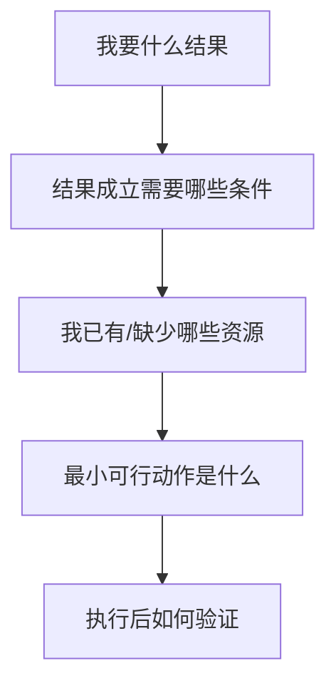

# 第3天：建立顶层思维

## 今天要抓住的一句话

高手不是想一步做一步，而是先看终局，再倒推路径。

## 图：结果倒推法

## 常见概念（通俗版）

1. 顶层思维：先看目标、结构、约束和关键变量，再决定动作。
2. 倒推：从想要的结果往前拆，而不是从眼前能做什么开始。
3. 关键变量：真正决定成败的少数因素，例如客户需求、信任、成本、渠道、交付能力。

## 表：低层思维和顶层思维对照

| 场景 | 低层思维 | 顶层思维 |
|---|---|---|
| 成长 | 今天学什么 | 哪个能力最影响未来收入 |
| 赚钱 | 有什么项目能做 | 谁有刚需，我能提供什么价值 |
| 社交 | 认识更多人 | 我能给关键人提供什么帮助 |
| 工作 | 老板让我做什么 | 这个任务最终要解决什么问题 |

## 常见问题（以及你该怎么做）

1. “我总是想很多但不行动。”
顶层思维不是空想。每次倒推都必须落到最小动作：今天能做什么、谁负责、什么时候交付。

2. “我不知道关键变量是什么。”
让 AI 帮你列出影响结果的变量，再按影响力和可控性排序，优先处理高影响、高可控的部分。

3. “计划经常变怎么办？”
结果和原则尽量稳定，路径可以调整。复盘时看变量变化，不要只抱怨环境。

## 最佳实践（今天就能用）

1. 用 AI 做一次“反向规划”：从目标到条件、资源、动作、风险。
2. 让 AI 扮演反方，指出你的计划里最脆弱的 3 个假设。
3. 把计划缩小到 24 小时内能验证的一步。

## 今日练习（20 分钟）

选择一个你想达成的目标，按下面模板写：

1. 结果：我最终要什么？
2. 条件：这个结果成立需要什么？
3. 资源：我已有和缺少什么？
4. 动作：今天最小一步是什么？
5. 验证：明天如何判断有没有推进？

## 优先级（今天先做什么）

| 优先级 | 事项 | 完成标准 |
|---|---|---|
| P0 | 写出一个结果倒推表 | 包含结果/条件/资源/动作/验证 |
| P1 | 找出 3 个关键变量 | 按影响力排序 |
| P2 | 执行一个 24 小时动作 | 明天能看到反馈 |
