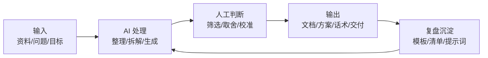

# 第4天：打造效率系统

## 今天要抓住的一句话

AI 的核心价值不是让你多做一点，而是让你少做低价值重复劳动。

## 图：个人 AI 工作流

## 常见概念（通俗版）

1. 重复劳动：整理资料、改写文本、生成初稿、列清单、做结构化总结。
2. 高价值劳动：判断取舍、关系经营、关键决策、创意方向、最终负责。
3. 工作流：固定的输入、处理、判断、输出、复盘路径。

## 表：最值得交给 AI 的任务

| 任务 | AI 负责 | 你负责 |
|---|---|---|
| 资料整理 | 摘要、分类、提取要点 | 判断重要性 |
| 文案初稿 | 结构、标题、版本对比 | 真实价值和语气 |
| 汇报材料 | 结论前置、逻辑梳理 | 数据准确和取舍 |
| 决策辅助 | 列选项、风险、反例 | 最终选择和承担后果 |
| 复盘 | 提炼问题、归纳模式 | 承认事实和修正行为 |

## 常见问题（以及你该怎么做）

1. “我用了 AI 反而更慢。”
说明你没有固定流程。把高频任务模板化，不要每次重新想怎么提问。

2. “AI 输出不准怎么办？”
先要求它列假设和不确定项，再由你补充事实。涉及数据、法律、医疗、金融等高风险内容必须核验来源。

3. “我应该自动化到什么程度？”
先自动化每天重复 3 次以上、每次超过 10 分钟的事情。

## 最佳实践（今天就能用）

1. 建一个“提示词模板库”：汇报、复盘、文案、谈判、学习、决策各一条。
2. 每次 AI 输出后，顺手沉淀为模板或清单。
3. 用固定格式管理任务：输入、目标、限制、输出格式、检查标准。

## 今日练习（15 分钟）

找出你今天最重复的一项工作，用 AI 改造成模板：

1. 任务名称：__________
2. 输入材料：__________
3. 期望输出：__________
4. 检查标准：__________
5. 可复用提示词：__________

## 优先级（今天先做什么）

| 优先级 | 事项 | 完成标准 |
|---|---|---|
| P0 | 找出一个高频重复任务 | 每天/每周都会出现 |
| P1 | 写成固定提示词模板 | 下次可直接复用 |
| P2 | 沉淀一份检查清单 | 能防止 AI 输出失控 |
