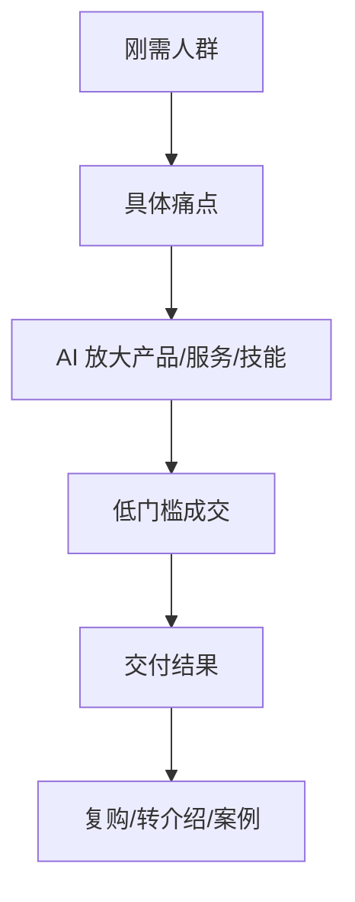

# 第5天：第一性赚钱逻辑

## 今天要抓住的一句话

赚钱不是追风口，赚钱是找到刚需，提供价值，降低成交成本，并能持续交付。

## 图：从需求到变现

## 常见概念（通俗版）

1. 刚需：用户不解决就会痛、会亏钱、会浪费时间或错失机会。
2. 认知钱：你比别人更会判断、更会设计方案、更会把复杂问题讲清楚。
3. 信息钱：你更早、更准、更系统地发现机会和资源。
4. 资源整合钱：你把人、工具、渠道、内容和交付组织起来。

## 表：AI 适合放大的 4 类变现

| 类型 | 示例 | 关键点 |
|---|---|---|
| 产品 | 模板、课程、资料包、工具 | 标准化、可复制 |
| 服务 | 文案、咨询、运营、自动化方案 | 交付结果清楚 |
| 技能 | 数据分析、写作、设计、编程辅助 | 有案例证明 |
| 整合 | 资源对接、方案打包、流程优化 | 降低客户成本 |

## 常见问题（以及你该怎么做）

1. “我不知道做什么赚钱。”
先别找项目，先找人群和痛点。问：谁有高频痛苦，谁愿意付费，AI 能不能降低我的交付成本。

2. “普通人没有资源怎么办？”
从小服务开始：帮一个具体人解决一个具体问题，拿案例，再复制。

3. “怎么避免赚辛苦钱？”
把交付过程模板化、产品化、标准化。不能复制的服务，会一直消耗你。

## 最佳实践（今天就能用）

1. 选赛道看 4 个条件：刚需大、成本低、可 AI 放大、复购强。
2. 低门槛成交：先用小结果建立信任，再提升客单价。
3. 利他先行：先给对方确定性价值，再谈长期合作。

## 今日练习（20 分钟）

用 AI 帮你拆一个变现方向：

1. 目标人群是谁？
2. 他们最痛的 3 个问题是什么？
3. 我能提供什么最小服务或产品？
4. AI 能帮我降低哪部分成本？
5. 第一个成交动作是什么？

## 优先级（今天先做什么）

| 优先级 | 事项 | 完成标准 |
|---|---|---|
| P0 | 选一个具体人群 | 不是“所有人” |
| P1 | 找到一个付费痛点 | 对方愿意花钱/时间解决 |
| P2 | 设计一个最小成交产品 | 低门槛、可交付、可复盘 |
