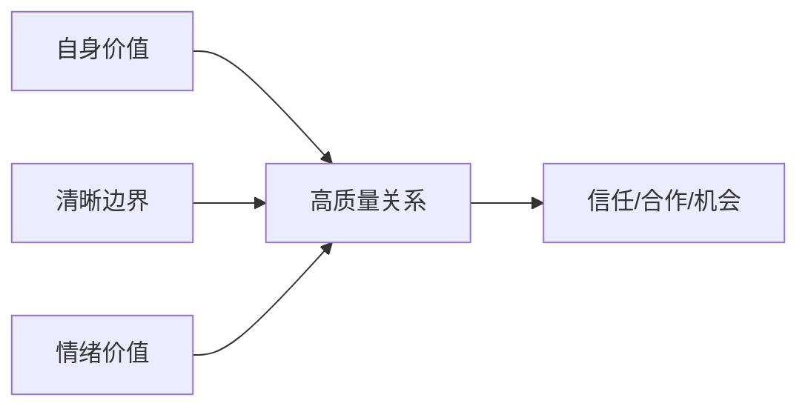

# 第6天：人际关系第一性

## 今天要抓住的一句话

讨好换不来稳定关系，价值、边界和情绪价值才会让关系长期成立。

## 图：高质量关系模型

## 常见概念（通俗版）

1. 价值：你能帮别人解决问题、节省时间、降低风险或带来机会。
2. 边界：你知道什么能答应，什么不能答应，什么需要交换条件。
3. 情绪价值：让对方被理解、被尊重、被支持，而不是只听你讲道理。

## 表：低质量社交和高质量社交

| 类型 | 典型表现 | 结果 |
|---|---|---|
| 讨好型 | 怕拒绝、怕冲突、无条件付出 | 被消耗、难被尊重 |
| 索取型 | 上来就要资源和机会 | 被防备、关系很浅 |
| 价值型 | 先理解需求，再提供帮助 | 容易建立信任 |
| 边界型 | 能帮就帮，不能帮说清楚 | 关系更稳定 |

## 常见问题（以及你该怎么做）

1. “我不会社交怎么办？”
先别追求会说话，先练会理解需求。让 AI 帮你模拟对话、准备开场、复盘表达。

2. “我总是不好意思拒绝。”
拒绝不是伤害关系，模糊和硬扛才会伤害关系。用 AI 先写一个尊重但清楚的拒绝版本。

3. “怎么进入强者圈子？”
不要靠混，靠贡献。先问自己：我能给对方带来什么信息、资源、结果或情绪支持。

## 最佳实践（今天就能用）

1. 少讲道理，多确认对方真实诉求。
2. 重要沟通前，用 AI 预演 3 种版本：直接版、温和版、坚定版。
3. 远离长期消耗型关系，把精力留给实干、守信、高认知的人。

## 今日练习（15 分钟）

选择一个你最近要沟通的人，用 AI 准备一版沟通方案：

1. 对方可能最在意什么？
2. 我能提供什么价值？
3. 我的边界是什么？
4. 我应该怎么开口？
5. 最坏情况如何收尾？

## 优先级（今天先做什么）

| 优先级 | 事项 | 完成标准 |
|---|---|---|
| P0 | 写出一个关键关系的价值交换点 | 知道双方各需要什么 |
| P1 | 准备一段清晰边界话术 | 能尊重但不委屈自己 |
| P2 | 复盘一次无效社交 | 判断它消耗了什么、下次如何避免 |
