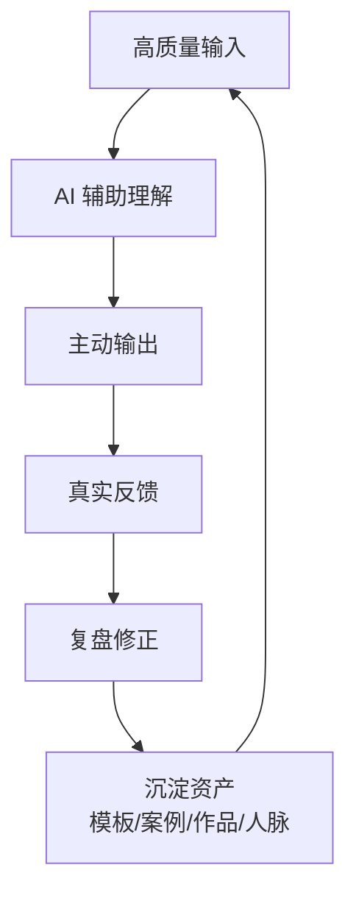

# 第7天：复利成长闭环

## 今天要抓住的一句话

真正的认知升级不是一时兴奋，而是把输入、输出、复盘和资产沉淀成每天运行的系统。

## 图：个人复利闭环

## 常见概念（通俗版）

1. 输入：书、课程、案例、客户反馈、行业信息。
2. 输出：文章、方案、产品、服务、沟通、交付。
3. 复盘：把结果和行为对齐，找出有效动作和错误假设。
4. 资产：能反复使用、带来信任或降低成本的东西。

## 表：每天最小复利动作

| 时间 | 动作 | 产出 |
|---|---|---|
| 早上 | 用 AI 梳理今日目标 | 1 个最重要结果 |
| 白天 | 用 AI 处理工作难题 | 节省时间，形成交付 |
| 晚上 | 复盘今天得失 | 1 条认知升级 |
| 每周 | 整理模板和案例 | 1 个可复用资产 |

## 常见问题（以及你该怎么做）

1. “我坚持不下去怎么办？”
降低启动成本。每天只要求一个可见输出，不追求完美。

2. “我学了很多但没变化。”
说明输入没有转成输出。每次学习后必须回答：我明天要改哪个动作。

3. “怎么形成个人标签？”
不贪多，围绕一个优势连续输出。别人想到某类问题时能想到你，标签才成立。

## 最佳实践（今天就能用）

1. 建立每日三问：今天要赢什么，AI 能帮什么，晚上复盘什么。
2. 所有高频问题都沉淀成模板、清单、案例或话术。
3. 每周只优化一个系统，不同时改太多。

## 今日练习（20 分钟）

写一份你的 30 天 AI 认知升级计划：

1. 我准备深耕的一个优势是什么？
2. 我每天的最小输出是什么？
3. 我每周沉淀什么资产？
4. 我用什么指标判断进步？
5. 我如何避免碎片化输入？

## 优先级（今天先做什么）

| 优先级 | 事项 | 完成标准 |
|---|---|---|
| P0 | 确定一个 30 天主线 | 只聚焦一个优势或方向 |
| P1 | 设计每日最小输出 | 每天 20 分钟内能完成 |
| P2 | 建立复盘和资产库 | 每周至少沉淀 1 个模板/案例/作品 |
