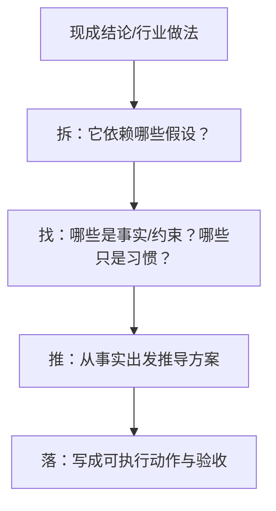

# 第一性原理：核心概念

## 一句话定义

第一性原理 = 把问题还原到“不可再省的底层事实/约束”，再从这些事实出发重新推演方案。

## 图：从“结论”退回“事实”

## 关键概念（通俗版）

1. 事实（Fact）：不因你喜好而改变的东西。比如“带宽有限”“人每天有效专注时间有限”“预算有上限”。
2. 约束（Constraint）：你不能绕开的限制。比如时间、资源、合规、能力边界。
3. 假设（Assumption）：你暂时认为成立，但可能错。必须写出来、可验证。
4. 目标（Goal）：你要赢什么，最好能验收。
5. 机制（Mechanism）：为什么这个方案能工作？不要只写“做什么”，要写“为什么会带来结果”。

## 表：事实/假设/观点 快速区分

| 类型 | 典型句式 | 是否需要验证 | 示例 |
|---|---|---|---|
| 事实 | “客观存在/不可改变” | 通常不需要（但要确认来源） | “当前 DAU=1.2 万” |
| 约束 | “必须满足/不能违反” | 需要明确边界 | “上线必须过安全审计” |
| 假设 | “我认为/可能/大概率” | 必须验证 | “新增入口会提高转化” |
| 观点 | “我觉得/最好/应该” | 需要回到事实推导 | “我们应该做得更精致” |

## 优先级（先掌握什么）

| 优先级 | 事项 | 完成标准 |
|---|---|---|
| P0 | 会区分事实/约束/假设 | 能把任意问题写成三栏清单 |
| P1 | 能写清“机制” | 每个方案都能回答“为什么会有效” |
| P2 | 能把假设变成实验/验证 | 给每个关键假设配验证方式与截止时间 |

