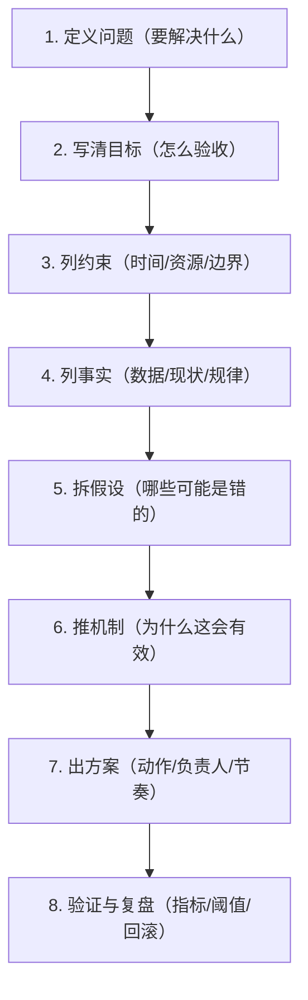

# 第一性原理：标准流程（可复用）

## 图：8 步从问题到方案

## 表：每一步你要产出什么

| 步骤 | 你要写下来的产出 | 常见坑 |
|---|---|---|
| 定义问题 | 1-2 句“问题陈述” | 把“方案”当“问题” |
| 写清目标 | 验收指标/截止时间 | 目标口号化 |
| 列约束 | 硬约束清单 | 约束没写导致方案不可落地 |
| 列事实 | 数据/现状/规律 | 把观点当事实 |
| 拆假设 | 关键假设列表 | 假设不写，后续争论无解 |
| 推机制 | 因果链路说明 | 只有动作没有为什么 |
| 出方案 | 任务卡（Owner/What/When/Done） | “推进一下”式任务 |
| 验证复盘 | 指标、阈值、实验周期 | 不设阈值，无法判断成败 |

## 优先级（从哪一步开始练）

| 优先级 | 事项 | 完成标准 |
|---|---|---|
| P0 | 问题陈述 + 验收目标 | 2 句话写清“要解决什么/如何验收” |
| P1 | 约束/事实/假设三栏 | 每栏至少 5 条，且可讨论可验证 |
| P2 | 机制 + 验证阈值 | 对每个关键假设给验证方式与阈值 |
