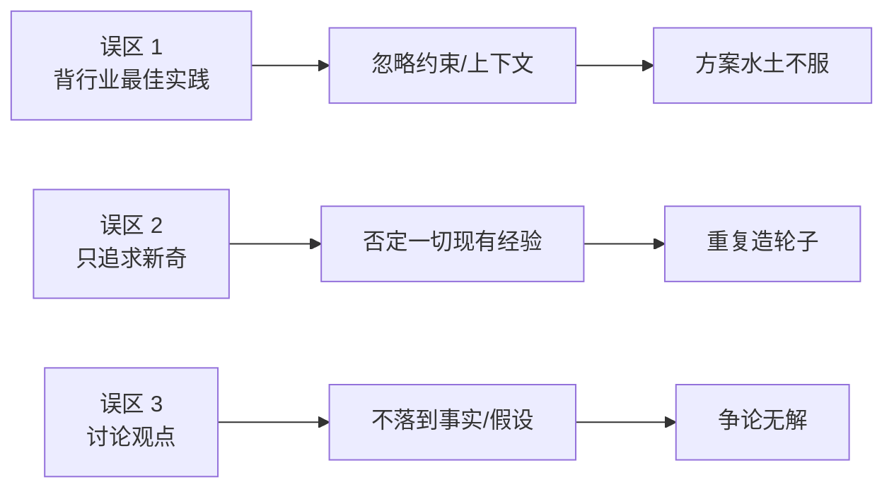

# 第一性原理：常见问题与误区

## 图：三种“看似在思考，其实在绕圈”

## 常见问题

### 1) “第一性原理是不是等于抛开经验、从零开始？”

不是。第一性原理是“先把经验当作假设”，再用事实/约束验证是否适用。

### 2) “我没有数据，怎么做第一性原理？”

先用“可观察事实”替代“完美数据”：用户访谈记录、日志、样本抽查、现场观察、对照组体验。关键是把“我觉得”改成“我看到/我验证到”。

### 3) “团队讨论总是吵起来，怎么落地？”

把争论从“观点对撞”切换为“假设清单”：我们分歧的是哪条假设？用什么验证？多久出结论？

### 4) “第一性原理会不会太慢？”

慢的是无效返工。第一性原理要做的是：在开工前把关键假设和约束定住，让后面快起来。

## 表：误区对照与纠正动作

| 误区 | 典型表现 | 纠正动作 |
|---|---|---|
| 把口号当目标 | “提升体验/加强管理” | 写成可验收指标 + 截止时间 |
| 把观点当事实 | “用户就是不喜欢” | 列证据来源 + 需要补的验证 |
| 方案没有机制 | “做 XX 就能增长” | 写出因果链：动作 -> 机制 -> 指标 |
| 不写假设 | 讨论靠气势 | 假设清单 + 验证方式 + 阈值 |
| 不设阈值 | 做了也不知道成败 | 指标阈值 + 止损/回滚条件 |

## 优先级（先纠正什么）

| 优先级 | 事项 | 完成标准 |
|---|---|---|
| P0 | 所有讨论先落到“假设清单” | 会议纪要里能看到假设与验证 |
| P1 | 每个方案写“机制” | 能回答“为什么会带来结果” |
| P2 | 为关键指标设阈值 | 事后可判断是否继续/停止 |
