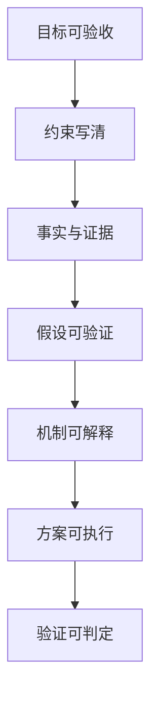

# 第一性原理：最佳实践与检查清单

## 图：高质量推演长什么样

## 表：第一性原理 12 项检查清单（开工前 5 分钟）

| 序号 | 检查项 | 通过标准 |
|---|---|---|
| 1 | 问题陈述清晰 | 1-2 句说清“要解决什么” |
| 2 | 目标可验收 | 指标 + 截止时间 |
| 3 | 边界明确 | 不做什么也写清 |
| 4 | 约束列全 | 时间/资源/合规/能力边界 |
| 5 | 事实有来源 | 数据/样本/访谈/日志等 |
| 6 | 假设写出来 | 至少 5 条关键假设 |
| 7 | 假设可验证 | 每条假设有验证方法 |
| 8 | 机制解释通 | 因果链能自洽 |
| 9 | 方案可执行 | 任务卡（Owner/When/Done） |
| 10 | 指标阈值明确 | 什么算成功/失败 |
| 11 | 止损/回滚条件 | 触发条件写清 |
| 12 | 复盘安排 | 复盘时间点与产出 |

## 常用最佳实践（落地版）

1. 先写“验收”，再写“方案”：没有验收就没有正确方向。
2. 把“争论点”翻译成“假设”：分歧不在观点，在假设。
3. 机制用一句话写清：`因为 ___，所以 ___ 会导致 ___。`
4. 关键假设最多 3 条优先验证：别把验证做成大型工程。
5. 先做最小可行验证（MVP 验证），再投入大资源。

## 优先级（先做哪几条最值）

| 优先级 | 事项 | 完成标准 |
|---|---|---|
| P0 | 目标可验收 + 约束清单 | 任何人读完都知道边界与成败 |
| P1 | 假设清单 + 验证方式 | 分歧点都能对应到验证 |
| P2 | 阈值 + 止损/回滚 | 项目不会“越做越大但不知道对不对” |
